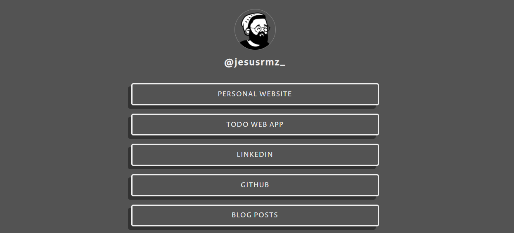

# Link Tree 🌳

This repo is for my personal created link tree: <a href="https://linktrr.jesusrmz.com/" target="_blank" rel="noopener">here</a>.

I made this because I've seen a lot of people on the internet using this new platform called Linktree, where basically you upload whatever quick links you want to show to the world.

But I didn't really like how the free/default looked, so instead of paying. I made my own 😎.

## Uses

This simple one page was made with HTML & SCSS.

I use Parcel as a bundler for production, and the creation of the live server during the development phase.

Hosted on Netlify 💚.

This is how it looks 👇🏼🔥

